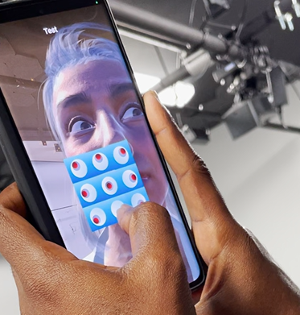

# VR Buttons

quickly import the fbx from blender and set up the rigid body and collider. Attach Buttonpress script on it and get audio source ready.&#x20;

.png>)

Testing it: since the buttons are on the table, when looking at model's face, you won't be able to see the buttons and model's face at the same time.&#x20;

We decided to make a floating control panel instead.

.png>)
