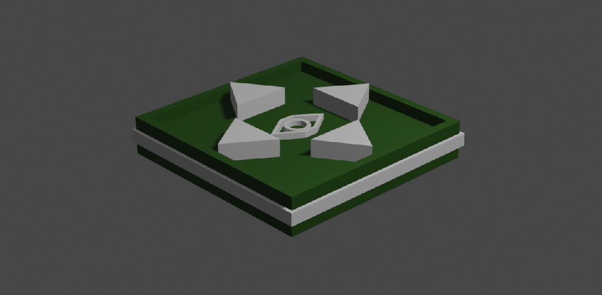

# VR Buttons

quickly import the fbx from blender and set up the rigid body and collider. Attach Buttonpress script on it and get audio source ready.&#x20;

.png>)

Testing it: since the buttons are on the table, when looking at model's face, you won't be able to see the buttons and model's face at the same time.&#x20;

```
if (upBTN.isPressing)
        {
            if (LookUporDown < 100)
            {
                LookUporDown = LookUporDown + Time.deltaTime * 100;
                down = 100-LookUporDown;
                up = LookUporDown;
            }
            else
            {
                return;
            }
        }
        else if (downBTN.isPressing)
        {
            if (LookUporDown > 1)
            {
                LookUporDown = LookUporDown - Time.deltaTime * 100;
                up = LookUporDown;
                down = 100- LookUporDown;
            }
            else
            {
                return;
            }
        }
        else
        {
            left = right = 0;
        }
        if (leftBTN.isPressing)
        {
            if (LookLeftorRight < 100)
            {
                LookLeftorRight = LookLeftorRight + Time.deltaTime * 100;
                left = LookLeftorRight;
                right = 100-LookLeftorRight;
            }
            else
            {
                return;
            }
        }
        else if (rightBTN.isPressing)
        {
            if (LookLeftorRight > 1)
            {
                LookLeftorRight = LookLeftorRight - Time.deltaTime * 100;
                right = 100-LookLeftorRight;
                left = LookLeftorRight; 
            }
            else
            {
                return;
            }
        }
```

We decided to make a floating control panel instead.

.png>).png>)

on the LeftHand wrist we had a red button which use OntriggerEnter() to show the floating panel, which contains the buttons to control model's movements


```
  private void OnTriggerEnter(Collider other)
    {
        if(other.name == "RightHandFingerTip")
        { 
            if (floatingPanel.activeSelf)
            {
                floatingPanel.SetActive(false);
            }
            else if( !floatingPanel.activeSelf)
             {
                floatingPanel.SetActive(true);
            }
        }
    }
```

